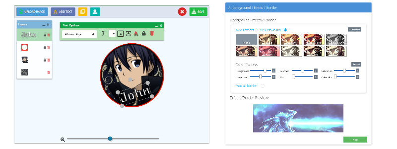

Here are some recent projects that I've made in my spare time over the last year or so:

### osu! Tournament System - [Live Demo](https://play.osustuff.org)

An automatic real-time tournament system build in Angular 7 and Node (with TypeScript) and MongoDB for a popular online game called 'osu!'. Over 2k registered users and weekly tournaments are run, with support for thousands of concurrent players.

### Foxbox Product Customiser - [Live Demo](https://foxbox.io/apps/product-editor/32290077578)

A web-app based in Angular 5 / Node (+Typescript) made for the website [Foxbox](https://foxbox.io), a printing business. The app allows customers to design their own decals and covers for tablets, mousepads and phones on the website. The demo link points directly to a product that can be customised and purchased.

### Discord Clone App - [Live Demo](https://chatapp.pubg.pet)

I made a clone of the popular chat app Discord using Angular 5 and MongoDB/Node (with Typescript). Source code is at: [https://github.com/Hughp135/angular-5-chat-app](https://github.com/Hughp135/angular-5-chat-app).

### osu! Bounties [Live Demo](https://www.osustuff.org/bounties/)

A website for people to place bounties for people to set scores on the game osu! This website is built using Angular 7 and uses a Laravel/MySQL back-end and is used by lots of members of the community to challenge each other in the game.

### Avatar maker made with Angular 5 + HTML5 Canvases - [Live Demo](https://www.osustuff.org/avatar-maker2)

Made in my spare time while studying, this is a tool for people to make profile pictures (avatars) [Avatar Maker](https://www.osustuff.org/avatar-maker2) and [Banner Maker](https://www.osustuff.org/banner-maker). Built with Laravel and Angular (v6). The website attracts ~15k monthly visitors.
