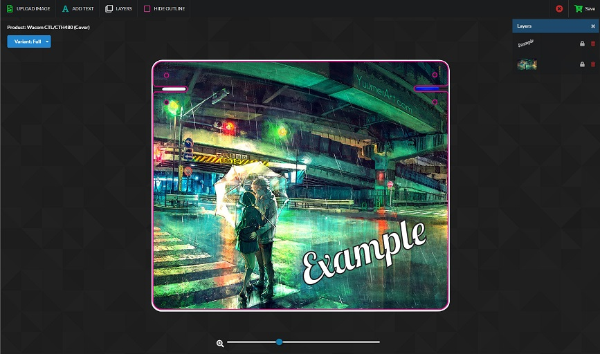
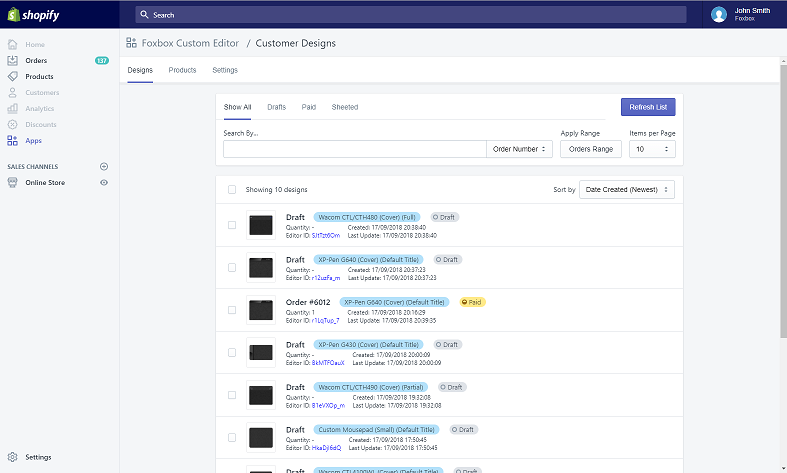

# Projects

## `Product Customiser Shopify App`

A Shopify-base app with an Angular v6 front-end that allows shops to have customisable products, currently in use by a real business with hundreds of monthly customers. To see the customisation app in action, select a product and click the 'Customize' button ([Direct Example](https://foxbox.io/apps/product-editor/32270605194)). The back-end is build in NodeJS and has an extensive admin panel built in React to manage orders and customer-made designs.

 

## `Discord Clone App` - a realtime text & voice chat app for Web and Desktop

A real-time communications/chat app built with NodeJS, MongoDB and Angular 5 and using Websockets. Heavily inspired by Discord and Slack.
[Live Demo](https://chatapp.pubg.pet) (You must register an account to use it - no e-mail required).

## `osustuff.org`

Built in my spare time while studying for my degree. A gaming website made for the community with useful image editing tools such as the [Avatar Maker](https://www.osustuff.org/avatar-maker2) and [Banner Maker](https://www.osustuff.org/banner-maker). Built with Laravel and Angular (v6) plus a lot of HTML/SCSS/JS/jQuery.

## `Real-time Game Streaming App`

A web and desktop app that allows users to live-stream video and take control of their home computer from any device over the internet or local network. A desktop app (built in Electron) captures the display of the computer and uses WebRTC and WebSocket technology to stream video and input data bi-directionally with as little as 20ms of latency to deliver a smooth gaming experience.
